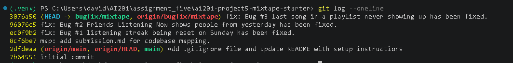

## AI Usage

I used AI tools during codebase navigation and debugging to clarify what individual functions and paths were doing before I formed my own hypotheses. For example, I asked about the behavior of `get_playlist_songs`, and the explanation helped me trace how playlist data was being returned and why one bug was happening. I also asked about the flow around streak updates and feed generation so I could compare the code’s actual control flow against the bug reports.

I did not use AI to write or patch the fixes. I verified the AI’s explanations by checking the relevant files and following the calls myself, and in a few cases the AI’s first explanation was incomplete, so I had to go back to the code and narrow down the exact condition causing the bug. That back-and-forth was useful because it forced me to confirm the logic directly instead of trusting a surface-level explanation.

## Codebase Map
    
### Routes

- `feed.py` handles requests for a user’s friend activity. It exposes endpoints for “listening now” and broader activity history, and its job is to take request data, call the feed service, and return the response.
- `playlists.py` handles playlist creation, retrieving playlist metadata, and adding or retrieving songs in a playlist. It is the route layer for playlist-related requests and passes the actual work to the playlist service.
- `songs.py` handles song lookup, search, ratings, and listening events. It is the main entry point for song-related actions and delegates business logic to the search and song-related service functions.
- `users.py` handles user lookup, streak retrieval, notifications, and marking notifications as read. It is the route layer that connects user-facing requests to notification and streak logic.

### Services

- `feed_service.py` builds the feed data shown to users by collecting friends’ recent listening activity and past activity.
- `notification_service.py` creates, retrieves, and marks notifications as read. It is also used when other actions, such as rating a song or adding one to a playlist, should trigger a notification.
- `playlist_service.py` contains the logic for creating playlists, retrieving playlist metadata, and returning the songs in a playlist.
- `search_service.py` handles song search and song lookup by ID.
- `streak_service.py` handles listening streak logic, including recording listening events and updating the current streak.

### Models

- `models.py` defines the database schema for users, tags, songs, playlists, ratings, listening events, and notifications. It also defines the association tables that connect users to songs, users to playlists, and songs to tags.
    
### Tests

- `test_playlists.py` checks playlist-song retrieval, including ordering and the empty-playlist case.
- `test_search.py` checks song search behavior, including matches, duplicate prevention, and empty queries.
- `test_streaks.py` checks streak behavior across consecutive days, skipped days, multiple listens on the same day, and Sunday behavior.

### App

- `app.py` is the application entry point. It initializes Flask, configures the database connection, and registers the routes.

### Data Flow for creating a playlist:

    1. The user sends a POST request to the /playlists endpoint with the necessary data to create a new playlist.
    2. The playlists route receives the request and calls the create_playlist() function in the playlist service.
    3. The playlist service processes the request, creates a new playlist in the database, and returns the newly created playlist's metadata.
    4. The playlists route sends a response back to the user with the newly created playlist's metadata, if successful, or an error message if the request was invalid, as in if the user did not add in the necessary attributes needed for the playlist or an error occurred in making the playlist.

### Patterns seen:

    - The application follows a layered architecture pattern, separating concerns into distinct layers: routes, services, and models. This promotes maintainability and scalability by allowing each layer to focus on its specific responsibilities. Additionally, because the application is structured in a modular way, it is easier to test and debug individual components without affecting the entire system. 

    - In almost every function, there is a form of error handling, which is important for ensuring that the application can gracefully handle situations where an action fails to complete successfully. 

### Root Cause Analysis of Bugs

Bug #1: My listening streak keeps resetting | `streak_service.py`
    - On line 73 of streak_service.py, the code checks if the user listened to a song yesterday and if today is not Sunday. This would cause the streak to reset on Sunday even if the user listened to a song on Saturday. To replicate this bug, I created a user and had them listen to a song on Saturday. Then, I had them listen to a song on Sunday. The streak reset to 1 instead of incrementing to 2.

Bug 2: Friends Listening Now shows people from yesterday | `feed_service.py` 
    
    - Inside the feed_service.py file, the issue arises from the RECENT_THRESHOLD constant being set to 24 hours. This means that if a friend listened to a song within the last 24 hours, they will be shown in the "Friends Listening Now" section, even if they listened to it yesterday. To reproduce this bug, I created a user and had them listen to a song at 4:50 PM. Then, I had their friend listen to a song at 2:36 AM the next day. When I checked the "Friends Listening Now" section, the friend was shown as listening to a song even though they listened to it yesterday.
    
     To fix this bug, there are multiple approaches that can be taken. One approach is to change the RECENT_THRESHOLD constant to a smaller value, such as 1 hour, so that only friends who have listened to a song within the last hour will be shown in the "Friends Listening Now" section. The main issue with this approach is that even if the friend listened to a song within an hour ago, you could be listening to a song at around 12:01 AM and your friend could have listened to a song at 11:59 PM, which would still show them in the "Friends Listening Now" section even though they listened to it yesterday. So, it depends on how the user wants to define "listening now". Though, the possibility of exploring real-time updates or using a more sophisticated time-based filtering mechanism could be considered to ensure that the "Friends Listening Now" section accurately reflects current activity. But, for simplicity, changing the RECENT_THRESHOLD constant to a smaller value, such as 1 hour, is a straightforward solution that can be implemented quickly.

Bug #3: The last song in a playlist never shows up | `playlist_service.py`

    - Inside the playlist_service.py file, the issue arises from the return statement in the get_playlist_songs function. The code currently returns all songs in the playlist except for the last one (songs[:-1]). This means that if a playlist has 5 songs, only the first 4 songs will be returned, and the last song will never be shown. To reproduce this bug, I created a playlist with 3 songs and then retrieved the playlist's songs. The last song was not included in the response. 

    To fix this bug, I modified the return statement to include all songs in the playlist by removing the slicing operation (songs[:-1]). The updated return statement now returns all songs in the playlist, ensuring that the last song is included in the response.

## Screenshot of git log showing the commits for the bug fixes
